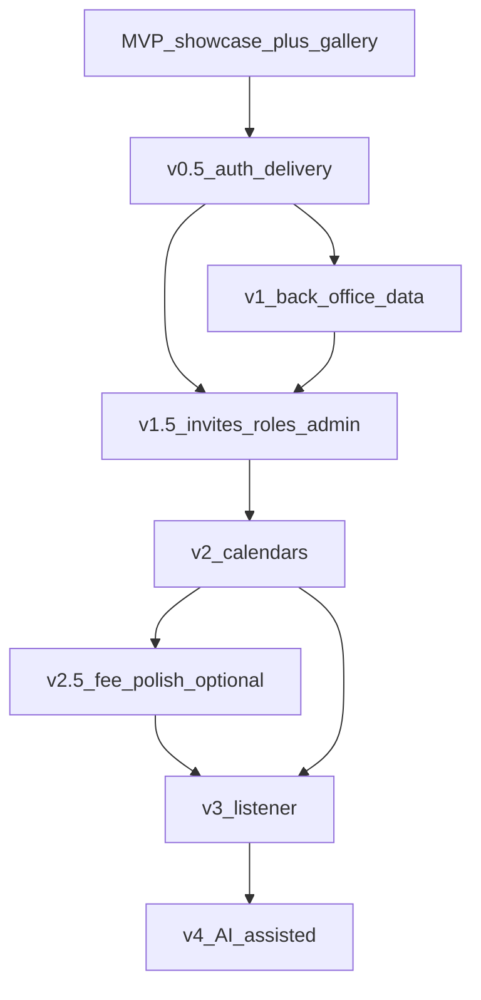

# ARC18 — project roadmap (build checklist)

**Normative product rules, roles, and permission matrix:** [project-spec.md](project-spec.md).  
**Public narrative (non-normative):** [README.md](README.md).

This file is a **checkable build roadmap** for humans and agents: when behaviour lands in `main`, update tasks in the **same change** as the feature where practical. **Incomplete:** `- [ ]` only. **Complete:** tick the Markdown checkbox, then a **space**, then **✅** (U+2705, white heavy check mark)—same line, **only** when done; never add **✅** to open tasks.

**Last reviewed:** 2026-04-22 (repository snapshot below).

---

## How to use (agents and maintainers)

- Treat [project-spec.md](project-spec.md) as the **authority** for permissions and domain rules; do **not** mark RBAC or capability items complete without checking **§3.2**.
- When ticking a box, follow the **complete** line convention from the paragraph above; prefer a **PR or commit reference** in your own notes; keep this file free of transient links if you prefer.
- If implementation **deliberately** diverges from the spec, add a short comment in the PR and **do not** tick the spec-aligned box until the spec is updated or the gap is listed here with an explicit **exception** checkbox.
- **MVP** scope (showcase + **Admin-managed landing gallery**) is **normative** in [project-spec.md](project-spec.md) **§2**, **§3.2**, and **§10.1**; this file adds **checkable** delivery tasks only.

---

## Current snapshot (repository vs roadmap)

The **public** Nuxt shell is in place (landing, infos, **contact** with a **contact form**: name, email, subject, message; client validation, `POST /api/contact`, and transactional mail via Mailtrap when runtime mail settings and `contactFormToEmail` are configured—see `.env.example`). French-oriented navigation; Instagram and Facebook URLs from runtime config. **JWT cookie auth** per project-spec §3.3: **`/login`** posts to `POST /api/auth/login` with **`credentials: 'include'`** and receives a **session** snapshot; **`GET /api/auth/session`** feeds the **`useAuthUser`** composable for UI gating; the site header calls **`POST /api/auth/logout`** to sign out. **Initial route protection** redirects unauthenticated visitors away from **`/club`**. User **roles** live in the **`auth_user_role`** joint table (**multiple roles** per user); Nitro handlers use **`requireRoles`** with **explicit** role lists and a **`developer`** bypass—**not** the **inherited** Admin > Manager > Member model in project-spec §3.1. The landing **carousel** is implemented with **static** placeholder images, not an **Admin-uploaded, curated** set backed by storage APIs. **Core back-office data** (archers, competitions, participations, users) has **DDD-shaped** use cases, Prisma models, and **protected** Nitro handlers using `requireRoles` in `server/utils/rbac.ts`. **Listing participations** via API is **Admin-only** today, not yet scoped to a Member’s own rows per §3.2. **Transactional mail** is wired for the **contact form** only; **invitation** / **fee-reminder**-style mail and broader mail-driven workflows in later phases are **not** implemented yet. **Invitations**, **revoke/unlink**, **promote/demote**, **calendars**, **Competition Listener**, and **AI-assisted** discovery are **not** implemented in the application layer (aside from schema/token enums where present).

---

## Phase dependency overview

Later phases assume earlier ones are **actually** complete (not only partially).

---

## MVP — Public showcase + Admin-managed landing gallery

**Spec reference:** [project-spec.md](project-spec.md) §2 (public website, **MVP landing gallery**), §3.2 (matrix row + explicit exclusions), §9 (security), §10.1 row **MVP**.

### Public showcase

- [x] ✅ **Landing** route and primary content (`app/pages/index.vue`).
- [x] ✅ **Infos** route (`app/pages/infos/`).
- [x] ✅ **Contact** route (`app/pages/contact/`).
- [x] ✅ **Contact form** on the contact page: fields **name**, **email**, **subject**, and **message**; validation, accessible labels, and a secure delivery path (API + mail or equivalent—align with [project-spec.md](project-spec.md) §9).
- [x] ✅ **Social:** prominent Instagram and Facebook links driven by configurable URLs (see `public` runtime config and `SocialSection.vue`).
- [x] ✅ **French-first** public navigation labels and tone (adjust remaining copy as needed).

### Staff-managed landing gallery (Admin only)

_Order: persistence and authenticated Admin surfaces before exposing mutations; then wire the public carousel._

- [ ] **Persistence:** store uploaded image metadata (and binary or object storage reference) in line with product choice; `file` in Prisma is a starting point—extend if you need carousel membership, ordering, or visibility.
- [ ] **Admin authentication** sufficient to protect gallery routes (can be the first slice of full login delivery; must satisfy §3.2 for who may upload).
- [ ] **Admin-only API** (or server actions) for **upload** with validation (size, type, rate limits as appropriate).
- [ ] **Admin-only API** for **curating the landing carousel** (which stored images appear, and **order** if required by design).
- [ ] **Public read path** for the landing carousel that reads the **curated** set (no reliance on hard-coded arrays in the carousel component for production).
- [ ] **Security:** no unauthorised upload or curation; no leakage of non-public assets if you introduce draft/unpublished states; align with project-spec §9.

### MVP exit criteria (self-check)

- [x] ✅ A visitor can submit the **contact form** (name, email, subject, message) from `/contact` and staff receive or can act on the message per your chosen delivery mechanism.
- [ ] A visitor sees the **same** public areas as today, but the **carousel** reflects **club-managed** content.
- [ ] Only **Admin** (per matrix; see §3.2) can change gallery content.

---

## v0.5 — Authenticated experience foundation

**Spec reference:** [project-spec.md](project-spec.md) §3 (authentication and authorisation), §3.3 (session model).

- [x] ✅ **Login** page (and flow) in Nuxt that calls `POST /api/auth/login` with **`credentials: 'include'`**.
- [x] ✅ **Logout** control that calls `POST /api/auth/logout`.
- [x] ✅ **Session awareness** in the client (`useAuthUser`, fed by **`GET /api/auth/session`**—handlers stay thin).
- [x] ✅ **Route protection** for staff areas where routes exist today (e.g. **`/club`**; extend when further member/manager/admin journeys ship).
- [x] ✅ **Fix navigation** so “Se connecter” / header actions do not target a missing route once login exists (`useSiteNavItems`, header).
- [x] ✅ Document for front-end agents: all mutating or private `fetch`/`$fetch` to same-origin APIs use **`credentials: 'include'`** per §3.3.

---

## v1 — Back-office: archers, competitions, participations (data + staff operations)

**Spec reference:** [project-spec.md](project-spec.md) §4 (domain concepts), §5 (competitions and participations), §10.1 row **v1**.

### Backend / domain (already largely present — keep in sync as you ship UI)

- [x] ✅ **Prisma models** for archer, competition, participation (and related enums).
- [x] ✅ **Domain rules** for participation/competition combinations (`domain/participations/participation.rules.ts` and spec §4.3.1).
- [x] ✅ **Use cases** and **Nitro handlers** for CRUD on archers, competitions, participations (with `requireRoles` on each handler).
- [ ] **Staff UI** (Nuxt) to perform day-to-day CRUD **without** using raw HTTP clients manually—usable by staff who have API access through the browser only.
- [ ] **Optional (from spec §10.2 alternative):** internal **read-only** competition list view for validation before full calendar work.

### Permission reality check (spec §3.2)

- [x] ✅ **Create / edit competitions** and **assign participants** remain **Admin-only** in API handlers (matches matrix).
- [ ] **Manager** capabilities from the matrix that appear **before** v1.5 (e.g. browsing competitions) have **matching** UI and APIs when you introduce Manager journeys (may overlap v0.5/v1.5).

---

## v1.5 — Invitations, role management, admin overview

**Spec reference:** [project-spec.md](project-spec.md) §3.2 (invite, promote/demote, revoke/unlink), §4.1–4.2 (Archer shell and Member linkage), §10.1 row **v1.5**.

**Depends on:** v0.5 (auth foundation) and v1 (data to attach people to).

- [ ] **Email-based invitation** flow for Manager/Admin to onboard **Members** (create or bind accounts, link Archer) — Prisma `token` / `token_type` may support this; implement use cases + ports.
- [ ] **RBAC** matches **inheritance** (Admin > Manager > Member) **or** document a deliberate exception and get product sign-off — today’s `requireRoles` uses **explicit** role lists (`server/utils/rbac.ts`).
- [ ] **Promote** Member → Manager; **demote** Manager → Member (Admin-only per matrix).
- [ ] **Revoke** access and **unlink** login from **Archer** without deleting historical participations (Admin-only; **Archer shell** invariant in §4.1).
- [ ] **Admin overview** surface: consolidated management for members, roles, and quick paths toward fee workflows (see also v2.5).

---

## v2 — Calendars

**Spec reference:** [project-spec.md](project-spec.md) §6 (calendars), §10.1 row **v2**.

- [ ] **Public** calendar (or equivalent) of **available** club competitions — placement per product (dedicated route vs section).
- [ ] **Logged-in Member** calendar of **their** participations only (enforce §3.2 visibility).
- [ ] **APIs** that support member-scoped reads (today’s list participations handler is Admin-wide — extend or add endpoints as needed).

---

## v2.5 — Participation fee polish (optional milestone)

**Spec reference:** [project-spec.md](project-spec.md) §3.2 (payment status, one-click emails), §5 (notifications), §10.2 alternative row **v2.5**.

_Can ship after v2 or be pulled earlier if the club prioritises fee follow-up._

- [ ] **Admin overview** of **missing participation fees** (dashboard-style).
- [ ] **Mail port** + transactional email infrastructure.
- [ ] **One-click** (or similarly low-friction) **payment request / reminder** emails per participation, initiated by Admin.

---

## v3 — Competition Listener

**Spec reference:** [project-spec.md](project-spec.md) §7 (Competition Listener), §10.1 row **v3**.

- [ ] **Scheduled job** architecture (cron or hosted scheduler).
- [ ] **Fetcher** for configured federation listing URL(s) with **timeouts** and **degraded** behaviour when HTML changes.
- [ ] **Compliance:** respect robots.txt, terms of use, and rate limits.
- [ ] **Notification** path (email or in-app) when a relevant new entry appears.

---

## v4 — AI-assisted competition discovery

**Spec reference:** [project-spec.md](project-spec.md) §8 (future AI workflow), §10.1 row **v4**.

- [ ] **Trusted sources** list maintained by the club/maintainer.
- [ ] **Suggestion** workflow for competitions not yet in the pool, with **human confirmation** before publication.
- [ ] **Guardrails** for quality and safety (no automatic publish without confirmation).

---

## Changelog (roadmap file only)

| Date       | Change                                                                 |
| ---------- | ---------------------------------------------------------------------- |
| 2026-04-22 | **v0.5**: **Logout** (header + `POST /api/auth/logout`), **`GET /api/auth/session`** / **`useAuthUser`**, **initial `/club` route protection**; snapshot reflects **`auth_user_role`** and explicit RBAC + **`developer`** bypass; tick front-end **`credentials: 'include'`** doc (normative **§3.3**). |
| 2026-04-17 | **v0.5**: **Login** page (`/login`, `credentials: 'include'`); tick **Fix navigation** (link now resolves); snapshot updated. |
| 2026-04-17 | MVP **Public showcase**: mark **contact form** and related **MVP exit** criterion complete (implemented in d6aa11d—`POST /api/contact`, Mailtrap); refresh snapshot. |
| 2026-04-16 | MVP **Public showcase**: add **contact form** task (name, email, subject, message) and exit criterion; clarify snapshot (contact route vs form). |
| 2026-04-15 | Initial roadmap: phases MVP–v4, MVP includes Admin-managed carousel. Completed checklist lines use **✅** after `- [x]`. |
