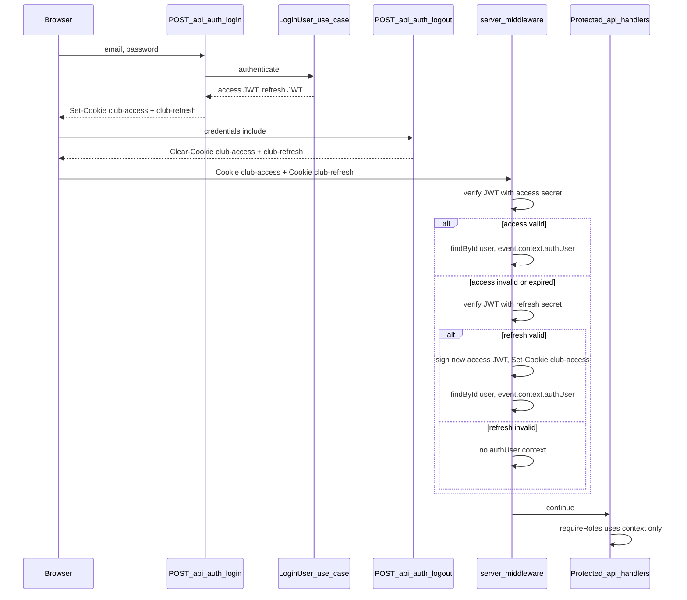

# ARC18 — Technical & product specification

This document describes goals, functional requirements, role permissions, domain concepts, phased delivery, and constraints for the full rework of the [ARC18 Wix site](https://archerschapelle.wixsite.com/arc18). The public-facing story lives in `[README.md](README.md)`.

## 1. Project goals & success criteria

**Goals**

- Replace the legacy showcase with a **simple, maintainable** web app that covers **public information** and **internal club operations** in one product.
- Provide a **single source of truth** for competitions, who participates, and **payment status** per participation—reducing reliance on ad hoc spreadsheets and threads.
- Enforce **clear roles** (Admin, Manager, Member) with **inheritance** so higher roles include lower-tier permissions without duplication of rules in the UI copy.

**Success criteria (indicative)**

- Staff can create a competition, attach participants, and see **who still owes a fee** in one overview.
- A **Member** can log in and see **only** their participations (and public competition listings as defined).
- **Revoking** access does not erase historical participation data (see **Archer shell** below).
- Public visitors can navigate **landing**, **infos**, **contact**, and **Actualités**, view a **landing carousel** of **images curated by the club** (see **MVP** under §2 and §10.1), read **recent club news** from the **Facebook feed** (v0.8), and reach **Instagram** and **Facebook** profile links.
- **Admins** can update **contact settings** (v1.1) and **Infos créneaux in place** on `/infos` (v1.2 POC) without code changes; remaining Infos/Accueil copy blocks follow later v1.2 slices.

## 2. Public website


| Area                    | Purpose                                                                                              |
| ----------------------- | ---------------------------------------------------------------------------------------------------- |
| **Landing**             | First impression, key messages, entry to the rest of the site.                                       |
| **Infos**               | Practical and club information (schedule, pricing, club philosophy—see **Editable public content**). |
| **Contact**             | How to reach the club: **site settings** (email, address, social links) plus the **contact form**; not a CMS page. |
| **Actualités**          | Public **Facebook feed** (v0.8): read-only recent posts with links to each post on Facebook.         |
| **Legal notice**        | LCEN publisher and host identification (`/legal-notice`); identity fields from **site settings**. |
| **Privacy policy**      | GDPR/CNIL privacy policy (`/privacy-policy`), including strictly necessary session cookies.         |


**Navigation**

- Four public top-level tabs: **Accueil** (landing), **Infos**, **Contact**, and **Actualités** (Facebook feed).

**Social feed (v0.8 — Actualités)**

- **Facebook only** in v0.8; **Instagram** remains a profile link (no feed).
- **Public** and **read-only**: display recent posts; **no** post, comment, like, or other in-app social interaction.
- Each listed post links to the **canonical Facebook post URL** on facebook.com.
- Fetch on the **server** with **caching**; Facebook **API credentials** stay in server environment variables (never exposed to the client).
- **Degraded mode:** if the API is unavailable, show an empty or error state with a prominent link to the club’s Facebook page—do not block the rest of the site.

**Site settings (v1.1)**

- **Admin-managed** values stored in JSON **`website_config`** (same pattern as the landing carousel): contact **email**, club **address** (practice venue, e.g. gymnasium), **Instagram** and **Facebook** profile URLs, plus **legal identity** used on mentions légales: **registered office** (siège social — **not** the gymnasium address), **publication director**, **RNA**, optional **SIRET**, and **hosting provider** name, address, and phone.
- The **Contact** page **displays** contact email, club address, and social links; it is not a surface for editable content blocks.
- Runtime config or environment variables may provide **seed defaults** until settings are saved; public social **display** URLs should ultimately come from admin-managed settings. Legal identity fields may start **empty** and must be filled before a public production launch.
- Facebook **API secrets** for the feed remain server-side env only.

**Legal pages and GDPR (pre-v2)**

- Public routes **`/legal-notice`** and **`/privacy-policy`**; footer links on every page (default layout). Copy is **versioned in code**; identity interpolates from site settings.
- The **contact form** shows an **information notice** (GDPR art. 13) and a link to `/privacy-policy`. **Do not** add an “I accept the GDPR” checkbox (false consent).
- Member space is **invitation-only** (no public self-registration). **No public terms of use (CGU).** When invitations ship (v1.5), the invitation e-mail and activation form must link to `/privacy-policy` (information only — still no CGU checkbox).
- Session cookies `club-access` and `club-refresh` are **strictly necessary**; document them in the privacy policy. **No cookie banner** unless a tracker, pixel, or client-side Facebook SDK is added.
- **No terms of sale (CGV)** until the site takes online payment or distance selling.
- Internal processing record and bureau checklist: [`docs/legal/registre-des-traitements.md`](docs/legal/registre-des-traitements.md), [`docs/legal/checklist-bureau.md`](docs/legal/checklist-bureau.md).

**Editable public content (v1.2)**

- **Admin-managed** content blocks, also in JSON **`website_config`**:
  - **Accueil:** welcome / foreword (`homepage_welcome`) — title, optional subtitle, paragraphs.
  - **Infos:** introduction (`infos_introduction`); **créneaux** (structured availability list under **`opening_hours`**, including the Infos section title and optional subtitle); **tarifs** (structured pricing list under **`tarifs`**: title, optional subtitle, intro, label/amount rows, styled callout segments); club philosophy (`club_philosophy`).
- **Hybrid editing model:** paragraphs are **text blocks**; créneaux and tarifs are **structured lists** with typed fields (labels, times, amounts)—not a single WYSIWYG page per section. Tarifs callout copy is a list of styled segments (`plain` / `highlight` / `emphasis`); a segment may insert the site-settings **contact email** as a `mailto:` link rather than storing an address.
- **Schedule authority:** créneaux detail lives on **Infos**; **Admins** edit them **in place** on that page (gear beside the section title). Contact **Quand ?** reads the same `opening_hours` **slots** read-only and keeps its own heading. Accueil welcome, Infos introduction, tarifs, and philosophy are Admin-editable **in place** on the public pages.

**Media**

- **MVP — landing gallery:** an **Admin** can **upload** pictures and **choose which uploaded images appear** on the public **landing** carousel (including **order** if the product requires it). Visitors see only that **curated** set on the carousel—no reliance on hard-coded placeholder assets in production. **Authenticated Admin** routes and APIs are required for upload and curation; apply **§3.2** (role checks on every sensitive path). For now, landing-gallery images are stored in configured CDN/object storage and referenced via JSON website config for carousel curation; Prisma `file` is intended for other assets (for example competition PDFs and related documents). Broader club galleries or **Manager** upload rights may come later; **MVP** scope is **Admin-only** for this workflow.
- **Beyond MVP:** additional club-managed visuals, other pages, or **Manager** participation in uploads remain **implementation details** to decide after MVP.

**Social**

- Prominent **Instagram** and **Facebook** profile links (URLs configurable; **v1.1** moves display URLs to admin-managed site settings).
- **v0.8:** public **Facebook feed** on the **Actualités** tab (see above)—read-only display, not required for MVP.

**Reference**

- Legacy site for content parity and tone: [archerschapelle.wixsite.com/arc18](https://archerschapelle.wixsite.com/arc18).

## 3. Authentication & authorisation

### 3.1 Role hierarchy

Three roles with **strict ordering**: **Admin > Manager > Member**.

- A **higher** role **inherits** all permissions of **lower** roles unless an exception is explicitly stated (none below—Admin-only actions are listed separately).

The **`developer`** value in the database and RBAC layer is a **technical** role for maintainers: it is **not** a club-facing permission tier in the matrix below. When authenticated, it is treated as **elevated** for route checks (see §3.3).

### 3.2 Permission matrix

Capabilities are cumulative by level.


| Capability                                                                                             | Member | Manager | Admin |
| ------------------------------------------------------------------------------------------------------ | ------ | ------- | ----- |
| View public pages                                                                                      | ✅     | ✅      | ✅    |
| View public **Actualités** feed (Facebook; **§2**)                                                     | ✅     | ✅      | ✅    |
| **Upload** and **curate** the **landing carousel** images (MVP club gallery; **§2**)                  | ❌     | ❌      | ✅    |
| **Edit site settings** (contact email, address, social profile URLs; **v1.1**)                         | ❌     | ❌      | ✅    |
| **Edit public content blocks** (Accueil welcome, Infos sections; **v1.2**)                             | ❌     | ❌      | ✅    |
| Log in                                                                                                 | ✅     | ✅      | ✅    |
| Browse **available competitions** (club-managed list/pool)                                             | ✅     | ✅      | ✅    |
| View **own** participations                                                                            | ✅     | ✅      | ✅    |
| Calendar-style view of **own** participations (when shipped)                                           | ✅     | ✅      | ✅    |
| Public calendar of **available** competitions (when shipped)                                           | ✅     | ✅      | ✅    |
| **Invite** a new Member (email-based onboarding)                                                       | ❌     | ✅      | ✅    |
| **Create** new Member accounts via invite flow                                                         | ❌     | ✅      | ✅    |
| **Competition Listener:** configure / “listen” to an external federation listing (when shipped)        | ❌     | ✅      | ✅    |
| **Create / edit** competition events and their details                                                 | ❌     | ❌      | ✅    |
| **Assign** Members or Managers as **participants** of a competition                                    | ❌     | ❌      | ✅    |
| **Payment:** view and change payment **status** for a Member **for a given competition participation** | ❌     | ❌      | ✅    |
| **Payment:** **one-click** actions (e.g. send payment request / reminder email)                        | ❌     | ❌      | ✅    |
| **Promote** a Member to Manager; **demote** Manager to Member                                          | ❌     | ❌      | ✅    |
| **Revoke** Member or Manager access; **unlink** login from internal **Archer** record                  | ❌     | ❌      | ✅    |


**Admin overview (dedicated)**

- Consolidated place to **manage members** (promote, revoke, etc.), **roles**, a **dashboard** of **missing participation fees**, and **quick** fee **reminder** emails (aligned with one-click participation fee actions).

**Explicit exclusions**

- Only **Admin** may **revoke** and **unlink** accounts from the **Archer** shell (preserving history).
- **Creating competitions** and **assigning participants** is **Admin-only** (not Manager) per current spec.
- **MVP landing gallery:** only **Admin** may **upload** images or **curate** the public landing **carousel** set (Manager upload is **out of scope** for MVP; revisit after MVP if the club wants to widen who may publish visuals).
- **Member invitation (shipped):** the matrix still lists **Manager** as an intended inviter, but **current delivery is Admin-only** (`POST /api/invitations`, ClubPanel on `/admin`). `/admin` is Admin-gated; Manager invite waits for a Manager-accessible surface. **Admin** may also **bind an existing unlinked Archer shell** via `POST /api/invitations/bind-archer` from the member roster (email only; `public_name` stays on the Archer). The admin roster list is **server-filtered and paginated** via `GET /api/members/roster` (`search`, `status`, `role`, `limit`, `offset`).

### 3.3 Technical session model (reference)

This subsection documents how the **implemented** HTTP session works today (**cookie-based JWTs**). There is **no** server-side **session** table: identity between requests is carried only in **HttpOnly** cookies. **User roles** are persisted separately in **`auth_user_role`** (a user may have **multiple** roles); that is **not** a session store.

- **Password storage:** `auth_user.password` holds an **Argon2id** hash (library defaults). Plain passwords are never stored.
- **Role storage:** `auth_user_role` links `auth_user` rows to `role` enum values. Authorisation in Nitro uses **explicit** allow-lists per route (`requireRoles`); **`developer`** bypasses product-role checks when authenticated (see §3.1). This does **not** implement automatic **inheritance** (Admin > Manager > Member) in code—that remains a product rule for v1.5 alignment ([project-roadmap.md](project-roadmap.md)).
- **Tokens:** Two **HS256 JWT** families—**access** (20-minute lifetime) and **refresh** (7-day lifetime)—signed with **two different secrets** (`NUXT_AUTH_JWT_ACCESS_SECRET` and `NUXT_AUTH_JWT_REFRESH_SECRET`). Access and refresh are **not** distinguished by custom JWT header fields or by extra payload “type” claims; separation is by **signing secret** and by **which cookie** carries the string, so a refresh token cannot be verified as an access token.
- **Cookies (HttpOnly):** `club-access` (access JWT) and `club-refresh` (refresh JWT). The browser should send both on same-origin API calls using **`credentials: 'include'`**.
- **Client contract:** Any same-origin **`fetch`** / **`$fetch`** to **private** or **mutating** API routes (including login, logout, session, and protected handlers) must use **`credentials: 'include'`** so cookies are sent.
- **Session snapshot for the client:** `GET /api/auth/session` returns `{ session: null }` when unauthenticated, or `{ session: { id, name, roles } }` when authenticated (aligned with `shared/auth/session-user.ts`). `POST /api/auth/login` responds with **`{ ok: true, session }`** after setting cookies, so the client can update UI without an extra round trip.
- **Middleware (Nitro):** On `/api/**` routes (except `POST /api/auth/login`), the server verifies the access JWT from `club-access`, loads the user from the database by `sub`, and sets server **`event.context`** for RBAC. If access is missing or invalid but `club-refresh` verifies, the server issues a **new** access JWT, sets **`Set-Cookie`** for `club-access`, then continues with the same user resolution.
- **Login / logout:** `POST /api/auth/login` validates email and password and sets both cookies. `POST /api/auth/logout` clears both cookies (no database session row to delete).
- **Password recovery:** `POST /api/auth/forgot-password` sends a transactional e-mail with a **recovery JWT** (separate verification from session access tokens) and records a **`token`** row (`forgot_password`). `POST /api/auth/reset-password` updates `auth_user.password` and sets that row’s **`used_at`** in one transaction, then issues new access and refresh cookies like a successful login.
- **Member invitation:** `POST /api/invitations` (**Admin**) creates an invited `auth_user` (`authenticated: false`) and a linked Archer, issues an **invitation JWT** (`token_type.invitation`, 7 days; not valid as a session access token), and sends template mail. `POST /api/invitations/bind-archer` (**Admin**) links an **existing unlinked** Archer shell to a new or pending invited account (same mail/token flow). `POST /api/auth/accept-invitation` sets the password, marks the user authenticated, consumes the token, and issues session cookies. See §3.2 (Admin-only delivery).
- **Member revoke:** `POST /api/users/:id/revoke` (**Admin**) unlinks all Archers from the user, clears the password, sets `authenticated: false`, and revokes unused tokens; the `auth_user` row and Archer history remain. Self-revoke is rejected. Session JWTs are not blocklisted (see revocation limits below).
- **Revocation limits:** Without server-side refresh/session storage, revoking **all** devices for a user is not automatic beyond password change, revoke (clears password), or future token blocklists.



## 4. Domain concepts

### 4.1 Archer (internal shell)

An **Archer** is an internal entity representing a person in the club’s data model. It can exist **before** any login exists (e.g. v1 back-office without email linking).

- Holds **historical** links to **participations** and related records.
- When a **Member** account is **revoked**, the **user** is unlinked from the Archer; the **Archer** and past participations remain for audit and continuity.

### 4.2 Member (authenticated user)

A **Member** is a user account that may be **linked** to an Archer. The shipped **Admin** invite flow **creates** a new Archer (`public_name` = invitee name) and links it to the new account. **Admin** may also invite an **existing unlinked Archer shell** (`POST /api/invitations/bind-archer`) from the member roster.

### 4.3 Competition & participation

- **Competition:** an event managed in the system (metadata: dates, title, detail fields—exact schema TBD).
- **Participation:** association of an **Archer** (or resolved via Member → Archer) to a **Competition**, with **fee / payment status** on that participation and workflow actions driven by **Admin**.

#### Participation and competition rules (business invariants)

These rules align with `prisma/schema.prisma` enums (`competition_category`, `competition_type`, `distance`, `target`, `payer`, `payment_status`). They are implemented in **`domain/participations/participation.rules.ts`**, enforced by the **local Prisma seed** (`npm run db:seed`), and must be respected by future back-office and APIs.

**Season year (`season_year` on competitions):** the sport year runs **September (calendar year Y) through August (year Y + 1)**. The stored value is **Y + 1** (e.g. September 2025–August 2026 → `2026`).

**Shared (participation)**

- **`payment_status`** must not be **`pending_reimbursement`** when **`payer`** is **`club`**.

**Indoor competitions (`category === indoor`)**

- **Type:** must **not** be **`beursault`**, **`field`**, or **`nature`** (see `competition_type` in the schema). Indoor events use only **`olympic`** or **`d3`**.
- **Distance — indoor + `olympic`:** only **`m18`** or **`beginner`**.
- **Distance — indoor + `d3`:** must be **`other`** (exception to the indoor olympic distance rule).
- **`target`:** may be set **only** for **indoor + `olympic`** (`trispot` / `spot40`); otherwise **`null`**.

**Outdoor competitions (`category === outdoor`)**

- **Distance:** must **not** be **`m18`**.
- **Types `field`, `nature`, `d3`:** participation **`distance`** must be **`other`**.
- **Type `beursault`:** **`distance`** must be **`m50`**.
- **Type `olympic`:** **`distance`** must be one of **`m50`**, **`m60`**, **`m70`**, **`beginner`** (see `distance` enum in the schema).
- **`target`:** must **not** be set — always **`null`**.

### 4.4 Bounded contexts (code organisation)

Implementation follows DDD slices with these **folder namespaces** (singular vs plural by convention): **`user`** (accounts, roles, invitations), **`archer`** (internal Archer records and linkage), **`competitions`** (competition events), **`participations`** (participation rows, including fee state). See `.cursor/rules/ddd-core.mdc`.

**Target repository layout** (convention—not all folders need to exist on day one):

```text
club-ai/
├── app/                          # Nuxt: pages, layouts, components (delivery)
├── server/api/                   # Nitro: thin handlers → use cases only
├── shared/                         # DTOs / types shared by client + server (no heavy domain logic)
│
├── domain/                         # Pure TypeScript: entities, value objects, invariants (no Prisma/Vue)
│   ├── user/                       # User account, Role (VO/enum), invitation-related rules
│   ├── archer/                     # Archer (internal shell), linkage invariants
│   ├── competitions/               # Competition (events)
│   └── participations/             # Participation (Archer ↔ Competition), fee status on participation
│
├── application/                    # Use-case classes; depends on domain + ports (interfaces)
│   ├── user/
│   ├── archer/
│   ├── competitions/
│   ├── participations/
│   └── ports/                      # e.g. UserRepository, ArcherRepository, CompetitionRepository, ParticipationRepository, MailPort
│
├── infrastructure/                 # Prisma, email, external adapters
│   └── persistence/               # Repository implementations; mappers Prisma ↔ domain
│
└── prisma/                         # schema, migrations; `prisma/seed/` for local dev (`npm run db:seed`)
```

**Notes**

- **`competitions`** vs **`participations`**: competition **metadata** lives under `competitions/`; each **enrollment** (who shoots where) and **fee state** live under `participations/`. Use cases that “sign someone up” orchestrate both contexts at the application layer.
- **`shared/`** stays free of domain invariants; keep transport/DTO shapes there when both sides need them.
- **`infrastructure/persistence/`** may mirror the same context subfolders (`user`, `archer`, …) if the team prefers; flat repos under one folder are also fine as long as mappers stay at the edges.
- **Ports and adapters**: declare repository (and other) contracts as **TypeScript interfaces** in **`application/ports/`**; implement them as **classes** in **`infrastructure/persistence/`** (`implements`). **Use cases** are **classes** in `application/<context>/` that take ports via constructors (see `.cursor/rules/ddd-core.mdc`). Server/API code obtains repository instances from a single **composition root**—**`infrastructure/persistence/repositories.provider.ts`**—rather than importing each adapter module from Nitro handlers (see `biome.json` and `.cursor/rules/prisma-repository.mdc`).
- **Nuxt imports**: in this codebase, **`~` points at `app/`**; import **`domain/`**, **`application/`**, **`infrastructure/`**, and **`shared/`** using the project-root alias **`~~/`** (documented in `.cursor/rules/ddd-core.mdc`).

## 5. Competitions and participations

- **Admin** creates competitions and details; assigns **Members** and/or **Managers** as participants (Managers participate as archers when assigned).
- Each participation carries **payment state** (see `payment_status` / `payer` in the schema). Combinations must follow **§4.3.1 Participation and competition rules**.
- **Browse (authenticated):** Member, Manager, and Admin can browse the club competition pool in a **list view** (`/competitions`) with filters; **own** participation fee/registration visibility follows §3.2. **Calendar-style** views remain §6 / v2.
- **Notifications:** at minimum **email** for **payment requests** and **reminders** initiated by Admin (one-click flows).

## 6. Calendars


| Audience             | Content                                                                 | Notes                                                          |
| -------------------- | ----------------------------------------------------------------------- | -------------------------------------------------------------- |
| **Anyone**           | Calendar (or equivalent) of **available** competitions in the club pool | Placement TBD: dedicated route vs section on an existing page. |
| **Logged-in Member** | Calendar (or equivalent) of **their** participations                    | Must respect Member-only data visibility.                      |

A **list/card browse** at `/competitions` satisfies part of the “browse available competitions” matrix row (§3.2); **calendar** milestones in [project-roadmap.md](project-roadmap.md) v2 are still open.


## 7. Competition Listener (advanced phase)

**Intent:** A **Manager** can register a **French archery federation** (or similar) **competition listing URL**—for example the FFTA competitions search result page—and the system **listens** for a **new “Mandat”** (or equivalent signal) appearing.

**Example URL shape (illustrative):**

`https://www.ffta.fr/index.php/competitions?search=&start=2026-04-10&end=2027-04-10&discipline=All&univers=299&inter=All&sort_by=start&sort_order=ASC`

**Mechanism (baseline):**

- **Scheduled job** (cron) + **basic scraping** / diff of the page or listing.
- **Email** (or in-app) **notification** when a new relevant entry is detected.

**Non-functional / compliance**

- Respect **robots.txt**, **terms of use**, and **rate limits**; implement **failure handling** (timeouts, HTML changes).
- Scraping may break when the source site changes—product should tolerate **degraded** mode and manual fallback.

## 8. Future: AI-assisted competition discovery (v4)

Evolve the Listener into an **AI-oriented workflow** that:

- Suggests **competitions** from a **small set of trusted sources** defined by the maintainer.
- Proposes **details** for competitions **not yet** in the club pool.
- Requires **human confirmation** before anything is published to the official competition list.

## 9. Non-functional requirements

- **Locale / context:** French club; UI copy and dates should align with French expectations.
- **Simplicity:** favour a **small** surface area over feature sprawl in early releases.
- **Accessibility:** baseline WCAG-minded patterns (exact audit scope TBD).
- **Security:** role checks on **every** sensitive action; protect **PII** and session boundaries.
- **Legal / GDPR:** public LCEN mentions and a CNIL-aligned privacy policy (purposes, legal bases, retention, processors, rights, CNIL complaint). Keep processing minimised. Update [`docs/legal/registre-des-traitements.md`](docs/legal/registre-des-traitements.md) when a new purpose is added.

---

## 10. Roadmaps

**Checkable sub-tasks** for delivery (including dependency order inside MVP) live in [`project-roadmap.md`](project-roadmap.md); the tables below summarise **phase intent**.

### 10.1 Primary roadmap (author’s plan)


| Phase    | Scope                                                                                                                                                     |
| -------- | --------------------------------------------------------------------------------------------------------------------------------------------------------- |
| **MVP**  | **Public showcase:** **landing**, **infos**, **contact**, configurable **Instagram** and **Facebook** links. **Plus:** **Admin-managed landing gallery**—upload images and **curate which appear** (and in which order, if required) on the landing **carousel**; public site reads that curated set. |
| **v0.8** | Public **Facebook feed** (**Actualités** tab): read-only recent posts with outbound links; server fetch + cache; degraded mode when API unavailable.        |
| **v1.1** | **Site settings** (Admin): contact email, club address, social profile URLs, **legal identity** (registered office, publication director, RNA/SIRET, host); **Contact** page wired to settings. |
| **v1.2** | **Editable public content** (Admin): Infos **créneaux**, Accueil welcome, Infos intro / tarifs / philosophy, in-place on the public pages. |
| **v1**   | **Back-office:** archers (internal shell), **competitions**, **participations**—**without** email linking yet (Archer before full Member implementation). |
| **v1.5** | **Member invitation**, **role management**, **Admin** panel **overview**.                                                                                 |
| **v2**   | **Calendar** overview (public competitions + member participations as specified).                                                                         |
| **v3**   | **Competition Listener** (cron + scrape + notify).                                                                                                        |
| **v4**   | **AI-assisted** workflow to seek and suggest competitions from **trusted** sources, with human validation.                                                |

**Note:** **v1** (operations back-office) and **v1.1 / v1.2** (public-site admin) are **parallel tracks**—not replacements for one another. Delivery order for the public-site milestones is **v0.8 → v1.1 → v1.2**; **v1** may proceed in parallel once **v0.5** auth foundation is in place.

### 10.2 Alternative roadmap (comparison)

Same product goals; different **sequencing** to reduce rework and front-load **RBAC** and **participation fee handling** once data exists.


| Phase    | Scope                                                                                                                                          |
| -------- | ---------------------------------------------------------------------------------------------------------------------------------------------- |
| **MVP**  | Same public showcase (**landing**, **infos**, **contact**) and **social** links; **images** on the landing **carousel** are **Admin-uploaded** and **Admin-curated** as in §2.                                                             |
| **v1**   | Archer, competitions, participations; add a **read-only competition list** (table/list, not full calendar) for internal validation.            |
| **v1.5** | **Authentication + RBAC** first; then **invitations** and account linking.                                                                     |
| **v2**   | **Full calendar** experience: public competitions + **my participations** for logged-in members.                                               |
| **v2.5** | **Participations** polish (fee tracking): Admin **overview**, dashboard of **missing participation fees**, **quick email reminders**—explicit release before Listener if desired. |
| **v3**   | **Competition Listener** (cron / scrape / email).                                                                                              |
| **v4**   | **AI-assisted** discovery (trusted sources, human confirmation).                                                                               |


**Comparison:** The primary roadmap emphasises **content and data model** before **auth**; the alternative introduces **auth and roles earlier** and may add a **thin list** before a **full calendar**, plus an optional **v2.5** milestone focused on **participation fees** and reminders. Either can be mixed (e.g. adopt “RBAC in v1.5” from the alternative without changing MVP numbering).